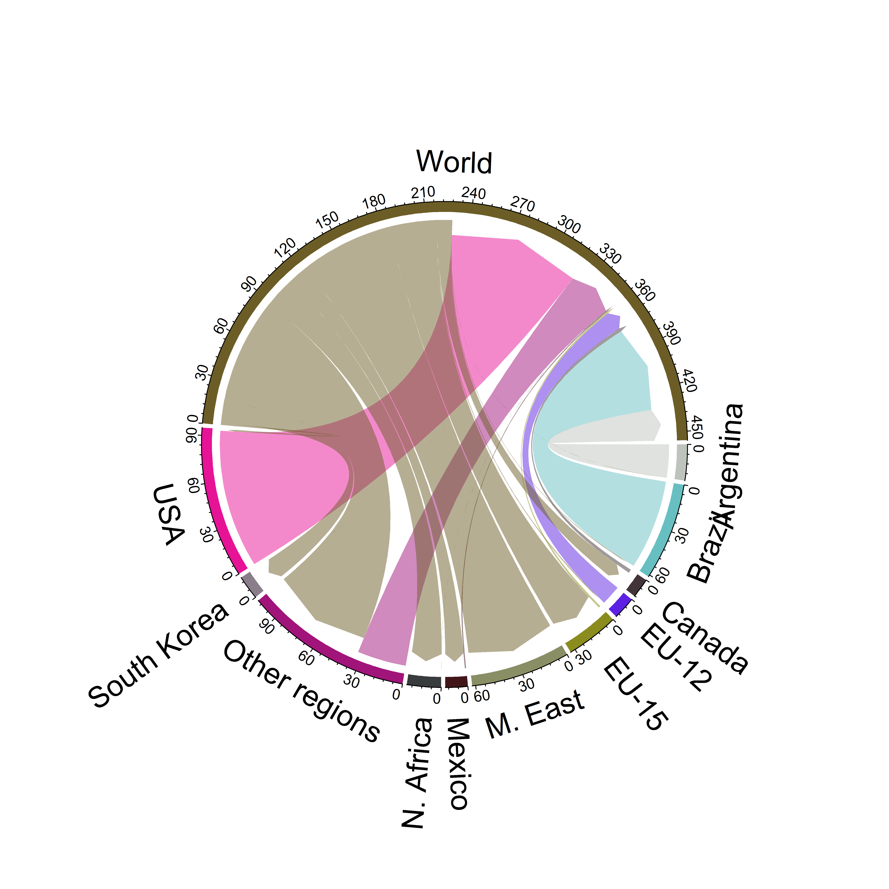

# GCAMCirclize
This R project generate circlize figures for **GCAM** to depict trade flows

R packages listed in run.R are required. 
Raw data generated from GCAM are stored in the folder Queriedcsv
Those data are processed to generate trade flows in the format to be used in circular package in R.
Example for corn trade flows in 2100:

